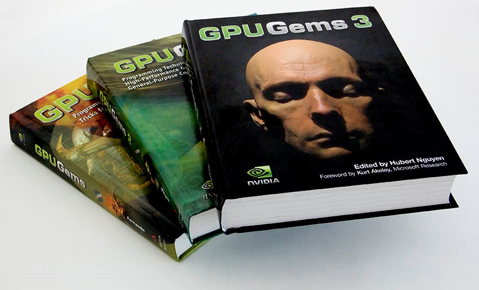

# GPU-Gems-CD-Content

CD Content ( Source Code ) of Book <GPU Gems 1~3>

 

## <GPU Gems 1> CD Conents

 - [ [In This Repository]GPU-Gems-1-CD-Content](/GPU-Gems-1-CD-Content/)

### Natural Effects

- [Effective Water Simulation from Physical Models](/GPU-Gems-1-CD-Content/Natural_Effects/Water_Simulation)
- [Rendering Water Caustics](/GPU-Gems-1-CD-Content/Natural_Effects/Caustics)
- [Skin in the "Dawn" Demo](/GPU-Gems-1-CD-Content/Natural_Effects/Dawn)
- [Animation in the "Dawn" Demo](/GPU-Gems-1-CD-Content/Natural_Effects/Dawn)
- [Fire in the "Vulcan" Demo](/GPU-Gems-1-CD-Content/Natural_Effects/Fire_Vulcan)
- [Rendering Countless Blades of Waving Grass](/GPU-Gems-1-CD-Content/Natural_Effects/Grass)
- [Simulating Diffraction](/GPU-Gems-1-CD-Content/Natural_Effects/Diffraction)
	
### Lighting and Shadows

- Efficient Shadow Volume Rendering
- Omnidirectional Shadow Mapping
- Generating Soft Shadows Using Occlusion Interval Maps
	
### Materials

- Image-Based Lighting
	
### Image Processing

- Color Controls
- Depth of Field: A Survey of Techniques
- High-Quality Filtering
- The OpenEXR File Format
- A Framework for Image Processing
	
### Performance and Practicalities

- Converting Production RenderMan Shaders to Real-Time
- Using FX Composer
- Integrating Hardware Shading into Cinema 4D
	
### Beyond Triangles

- A Toolkit for Computation on GPUs
- Fast Fluid Dynamics on the GPU
- Real-Time Stereograms
- Applying Real-Time Shading to 3D Ultrasound Visualization

 

- [ [NVIDIA Official Website] Table of Contents of <GPU Gems 1> ](http://http.download.nvidia.com/developer/GPU_Gems/CD_Image/Index.html)

 

## <GPU Gems 2> CD Conents

### Geometric Complexity

- Ch. 02: Terrain Rendering using GPU-Based Geometry Clipmaps
- Ch. 06: Hardware Occlusion Queries Made Useful
- Ch. 07: Adaptive Tessellation of Subdivision Surfaces 
             with Displacement Mapping
- Ch. 08: Per-Pixel Displacement Mapping with Distance Functions
 	
### Shading, Lighting, and Shadows

- Ch. 10: Real-Time Computation of Dynamic Irradiance Environment Maps
- Ch. 11: Approximate Bidirectional Texture Functions
- Ch. 12: Tile-Based Texture Mapping
- Ch. 14: Dynamic Ambient Occlusion and Indirect Lighting
- Ch. 15: Blueprint Rendering and "Sketchy Drawings"
- Ch. 16: Accurate Atmospheric Scattering
- Ch. 17: Efficient Soft-Edged Shadows Using Pixel Shader Branching
- Ch. 18: Using Vertex Texture Displacement for Realistic Water Rendering
- Ch. 19: Generic Refraction Simulation
 	
### High-Quality Rendering

- Ch. 20: Fast Third-Order Texture Filtering
- Ch. 21: High Quality Antialiased Rasterization
- Ch. 23: Hair Animation and Rendering in the Nalu Demo
- Ch. 26: Implementing Improved Perlin Noise
- Ch. 28: Mipmap Level Measurement
 	
### General-Purpose Computation on GPUs: A Primer

- Ch. 31: Mapping Computational Concepts to GPUs
- Ch. 36: Stream Reduction Operations for GPGPU Applications
 	
### Image-Oriented Computing

- Ch. 37: Octree Textures on the GPU
- Ch. 38: High-Quality Global Illumination Using Rasterization
- Ch. 40: Computer Vision on the GPU
- Ch. 42: Conservative Rasterization
 	
### Simulation and Numerical Algorithms

- Ch. 43: GPU Computing for Protein Structure Prediction
- Ch. 44: A GPU Framework for Solving Systems of Linear Equations
- Ch. 45: Options Pricing on the GPU
- Ch. 46: Improved GPU Sorting
- Ch. 48: Medical Image Reconstruction with the FFT

  

 - [ [NVIDIA Official Website] Table of Contents of <GPU Gems 2> ](http://download.nvidia.com/developer/GPU_Gems_2/CD/Index.html)

 

# <GPU Gems> Full Book Web Version

- [<GPU Gems 1> Full Book Web Version](https://developer.nvidia.com/gpugems/GPUGems/gpugems_pref01.html)
- [<GPU Gems 2> Full Book Web Version](https://developer.nvidia.com/gpugems/GPUGems2/gpugems2_inside_front_cover.html)
- [<GPU Gems 3> Full Book Web Version](https://developer.nvidia.com/gpugems/GPUGems3/gpugems3_pref01.html)

