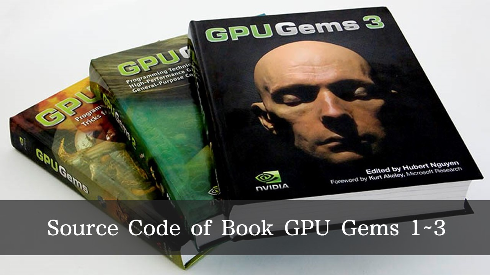
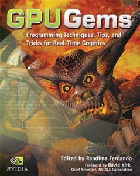
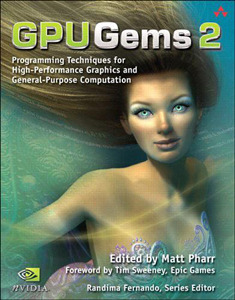
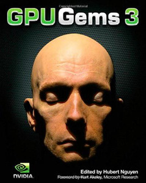

# GPU Gems CD Content

CD Content ( Source Code ) of Book < GPU Gems > 1~3

 

# <GPU Gems 1> CD Conents

## Natural Effects

- [Effective Water Simulation from Physical Models](/GPU-Gems-1-CD-Content/Natural_Effects/Water_Simulation)
- [Rendering Water Caustics](/GPU-Gems-1-CD-Content/Natural_Effects/Caustics)
- [Skin in the "Dawn" Demo](/GPU-Gems-1-CD-Content/Natural_Effects/Dawn)
- [Animation in the "Dawn" Demo](/GPU-Gems-1-CD-Content/Natural_Effects/Dawn)
- [Fire in the "Vulcan" Demo](/GPU-Gems-1-CD-Content/Natural_Effects/Fire_Vulcan)
- [Rendering Countless Blades of Waving Grass](/GPU-Gems-1-CD-Content/Natural_Effects/Grass)
- [Simulating Diffraction](/GPU-Gems-1-CD-Content/Natural_Effects/Diffraction)
	
## Lighting and Shadows

- [Efficient Shadow Volume Rendering](/GPU-Gems-1-CD-Content/Lighting_and_Shadows/Shadow_Volumes)
- [Omnidirectional Shadow Mapping](/GPU-Gems-1-CD-Content/Lighting_and_Shadows/Omni_Shadow_Mapping)
- [Generating Soft Shadows Using Occlusion Interval Maps](/GPU-Gems-1-CD-Content/Lighting_and_Shadows/Occlusion_Interval_Maps)
	
## Materials

- [Image-Based Lighting](/GPU-Gems-1-CD-Content/Materials/Image_Based_Lighting)
	
## Image Processing

- [Color Controls](/GPU-Gems-1-CD-Content/Image_Processing/Color_Controls)
- [Depth of Field: A Survey of Techniques](/GPU-Gems-1-CD-Content/Image_Processing/Depth_of_Field)
- [High-Quality Filtering](/GPU-Gems-1-CD-Content/Image_Processing/High_Quality_Filtering)
- [The OpenEXR File Format](/GPU-Gems-1-CD-Content/Image_Processing/OpenEXR)
- [A Framework for Image Processing](/GPU-Gems-1-CD-Content/Image_Processing/Image_Processing_Framework)
	
## Performance and Practicalities

- [Converting Production RenderMan Shaders to Real-Time](/GPU-Gems-1-CD-Content/Performance_and_Practicalities/Converting_Shaders)
- [Using FX Composer](/GPU-Gems-1-CD-Content/Performance_and_Practicalities/Using_FX_Composer)
- [Integrating Hardware Shading into Cinema 4D](/GPU-Gems-1-CD-Content/Performance_and_Practicalities/Integrating_HW_Shading)
	
## Beyond Triangles

- [A Toolkit for Computation on GPUs](/GPU-Gems-1-CD-Content/Beyond_Triangles/Toolkit_for_GPUs)
- [Fast Fluid Dynamics on the GPU](/GPU-Gems-1-CD-Content/Beyond_Triangles/Fluids)
- [Real-Time Stereograms](/GPU-Gems-1-CD-Content/Beyond_Triangles/Stereograms)
- [Applying Real-Time Shading to 3D Ultrasound Visualization](/GPU-Gems-1-CD-Content/Beyond_Triangles/Ultrasound)

 

[ [NVIDIA Official Website] Table of Contents of <GPU Gems 1> CD Content ](http://http.download.nvidia.com/developer/GPU_Gems/CD_Image/Index.html)

 

# <GPU Gems 2> CD Conents

## Geometric Complexity

- [Ch. 02: Terrain Rendering using GPU-Based Geometry Clipmaps](/GPU-Gems-2-CD-Content/Geometric_Complexity/Ch_02_Terrain_Rendering_using_GPU-Based_Geometry_Clipmaps)
- [Ch. 06: Hardware Occlusion Queries Made Useful](/GPU-Gems-2-CD-Content/Geometric_Complexity/Ch_06_Hardware_Occlusion_Queries_Made_Useful)
- [Ch. 07: Adaptive Tessellation of Subdivision Surfaces with Displacement Mapping](/GPU-Gems-2-CD-Content/Geometric_Complexity/Ch_07_Adaptive_Tessellation_of_Subdivision_Surfaces_)
- [Ch. 08: Per-Pixel Displacement Mapping with Distance Functions](/GPU-Gems-2-CD-Content/Geometric_Complexity/Ch_08_Per-Pixel_Displacement_Mapping_with_Distance_Functions)
 	
## Shading, Lighting, and Shadows

- [Ch. 10: Real-Time Computation of Dynamic Irradiance Environment Maps](/GPU-Gems-2-CD-Content/Shading_Lighting_and_Shadows/Ch_10_Real-Time_Computation_of_Dynamic_Irradiance_Environment_Maps)
- [Ch. 11: Approximate Bidirectional Texture Functions](/GPU-Gems-2-CD-Content/Shading_Lighting_and_Shadows/Ch_11_Approximate_Bidirectional_Texture_Functions)
- [Ch. 12: Tile-Based Texture Mapping](/GPU-Gems-2-CD-Content/Shading_Lighting_and_Shadows/Ch_12_Tile-Based_Texture_Mapping)
- [Ch. 14: Dynamic Ambient Occlusion and Indirect Lighting](/GPU-Gems-2-CD-Content/Shading_Lighting_and_Shadows/Ch_14_Dynamic_Ambient_Occlusion_and_Indirect_Lighting)
- [Ch. 15: Blueprint Rendering and "Sketchy Drawings"](/GPU-Gems-2-CD-Content/Shading_Lighting_and_Shadows/Ch_15_Blueprint_Rendering_and_Sketchy_Drawings)
- [Ch. 16: Accurate Atmospheric Scattering](/GPU-Gems-2-CD-Content/Shading_Lighting_and_Shadows/Ch_16_Accurate_Atmospheric_Scattering)
- [Ch. 17: Efficient Soft-Edged Shadows Using Pixel Shader Branching](/GPU-Gems-2-CD-Content/Shading_Lighting_and_Shadows/Ch_17_Efficient_Soft-Edged_Shadows_Using_Pixel_Shader_Branching)
- [Ch. 18: Using Vertex Texture Displacement for Realistic Water Rendering](/GPU-Gems-2-CD-Content/Shading_Lighting_and_Shadows/Ch_18_Using_Vertex_Texture_Displacement_for_Realistic_Water_Rendering)
- [Ch. 19: Generic Refraction Simulation](/GPU-Gems-2-CD-Content/Shading_Lighting_and_Shadows/Ch_19_Generic_Refraction_Simulation)
 	
## High-Quality Rendering

- [Ch. 20: Fast Third-Order Texture Filtering](/GPU-Gems-2-CD-Content/High-Quality_Rendering/Ch_20_Fast_Third-Order_Texture_Filtering)
- [Ch. 21: High Quality Antialiased Rasterization](/GPU-Gems-2-CD-Content/High-Quality_Rendering/Ch_21_High_Quality_Antialiased_Rasterization)
- [Ch. 23: Hair Animation and Rendering in the Nalu Demo](/GPU-Gems-2-CD-Content/High-Quality_Rendering/Ch_23_Hair_Animation_and_Rendering_in_the_Nalu_Demo)
- [Ch. 26: Implementing Improved Perlin Noise](/GPU-Gems-2-CD-Content/High-Quality_Rendering/Ch_26_Implementing_Improved_Perlin_Noise)
- [Ch. 28: Mipmap Level Measurement](/GPU-Gems-2-CD-Content/High-Quality_Rendering/Ch_28_Mipmap_Level_Measurement)
 	
## General-Purpose Computation on GPUs: A Primer

- [Ch. 31: Mapping Computational Concepts to GPUs](/GPU-Gems-2-CD-Content/General-Purpose_Computation_on_GPUs_A_Primer/Ch_31_Mapping_Computational_Concepts_to_GPUs)
- [Ch. 36: Stream Reduction Operations for GPGPU Applications](/GPU-Gems-2-CD-Content/General-Purpose_Computation_on_GPUs_A_Primer/Ch_36_Stream_Reduction_Operations_for_GPGPU_Applications)
 	
## Image-Oriented Computing

- [Ch. 37: Octree Textures on the GPU](/GPU-Gems-2-CD-Content/Image-Oriented_Computing/Ch_37_Octree_Textures_on_the_GPU)
- [Ch. 38: High-Quality Global Illumination Using Rasterization](/GPU-Gems-2-CD-Content/Image-Oriented_Computing/Ch_38_High-Quality_Global_Illumination_Using_Rasterization)
- [Ch. 40: Computer Vision on the GPU](/GPU-Gems-2-CD-Content/Image-Oriented_Computing/Ch_40_Computer_Vision_on_the_GPU)
- [Ch. 42: Conservative Rasterization](/GPU-Gems-2-CD-Content/Image-Oriented_Computing/Ch_42_Conservative_Rasterization)
 	
## Simulation and Numerical Algorithms

- [Ch. 43: GPU Computing for Protein Structure Prediction](/GPU-Gems-2-CD-Content/Simulation_and_Numerical_Algorithms/Ch_43_GPU_Computing_for_Protein_Structure_Prediction)
- [Ch. 44: A GPU Framework for Solving Systems of Linear Equations](/GPU-Gems-2-CD-Content/Simulation_and_Numerical_Algorithms/Ch_44_A_GPU_Framework_for_Solving_Systems_of_Linear_Equations)
- [Ch. 45: Options Pricing on the GPU](/GPU-Gems-2-CD-Content/Simulation_and_Numerical_Algorithms/Ch_45_Options_Pricing_on_the_GPU)
- [Ch. 46: Improved GPU Sorting](/GPU-Gems-2-CD-Content/Simulation_and_Numerical_Algorithms/Ch_46_Improved_GPU_Sorting)
- [Ch. 48: Medical Image Reconstruction with the FFT](/GPU-Gems-2-CD-Content/Simulation_and_Numerical_Algorithms/Ch_48_Medical_Image_Reconstruction_with_the_FFT)

  

[ [NVIDIA Official Website] Table of Contents of <GPU Gems 2> CD Content ](http://download.nvidia.com/developer/GPU_Gems_2/CD/Index.html)

 

# <GPU Gems 3> CD Conents

## Geometry

- [Ch. 01: Generating Complex Procedural Terrains Using the GPU](/GPU-Gems-3-CD-Content/content/01)
- [Ch. 02: Animated Crowd Rendering](/GPU-Gems-3-CD-Content/content/02)
- [Ch. 03: DirectX 10 Blend Shapes: Breaking the Limits](/GPU-Gems-3-CD-Content/content/03)
- [Ch. 04: Next-Generation SpeedTree Rendering](/GPU-Gems-3-CD-Content/content/04)
- [Ch. 06: GPU-Generated Procedural Wind Animations for Trees](/GPU-Gems-3-CD-Content/content/06)
 	
## Light and Shadows

- [Ch. 08: Summed-Area Variance Shadow Maps](/GPU-Gems-3-CD-Content/content/08)
- [Ch. 10: Parallel-Split Shadow Maps on Programmable GPUs](/GPU-Gems-3-CD-Content/content/10)
- [Ch. 12: High-Quality Ambient Occlusion](/GPU-Gems-3-CD-Content/content/12)
- [Ch. 13: Volumetric Light Scattering as a Post-Process](/GPU-Gems-3-CD-Content/content/13)
 	
## Rendering

- [Ch. 14: Advanced Techniques for Realistic Real-Time Skin Rendering](/GPU-Gems-3-CD-Content/content/14)
- [Ch. 16: Vegetation Procedural Animation and Shading in Crysis](/GPU-Gems-3-CD-Content/content/16)
- [Ch. 17: Robust Multiple Specular Reflections and Refractions](/GPU-Gems-3-CD-Content/content/17)
- [Ch. 18: Relaxed Cone Stepping for Relief Mapping](/GPU-Gems-3-CD-Content/content/18)
- [Ch. 20: GPU-Based Importance Sampling](/GPU-Gems-3-CD-Content/content/20)
 	
## Image Effects

- [Ch. 21: True Impostors](/GPU-Gems-3-CD-Content/content/21)
- [Ch. 26: Object Detection by Color: Using the GPU for Real-Time Video Image Processing (Mac OS X only)](/GPU-Gems-3-CD-Content/content/26)
 	
## Physics Simulation

- [Ch. 29: Real-Time Rigid Body Simulation on GPUs](/GPU-Gems-3-CD-Content/content/29)
- [Ch. 31: Fast N-Body Simulation with CUDA](/GPU-Gems-3-CD-Content/content/31)
- [Ch. 33: Broad-Phase Collision Detection with CUDA](/GPU-Gems-3-CD-Content/content/33)
 	
## GPU Computing

- [Ch. 36: AES Encryption and Decryption on the GPU](/GPU-Gems-3-CD-Content/content/36)
- [Ch. 37: Efficient Random Number Generation and Application Using CUDA](/GPU-Gems-3-CD-Content/content/37)

  

:neutral_face: PS: NVIDIA did not provide official website for <GPU Gems 3> CD Content

  

 

# 【Bonus】Full Book Web Version of GPU Gems 1~3

- [<GPU Gems 1> Full Book Web Version](https://developer.nvidia.com/gpugems/GPUGems/gpugems_pref01.html)
- [<GPU Gems 2> Full Book Web Version](https://developer.nvidia.com/gpugems/GPUGems2/gpugems2_inside_front_cover.html)
- [<GPU Gems 3> Full Book Web Version](https://developer.nvidia.com/gpugems/GPUGems3/gpugems3_pref01.html)
